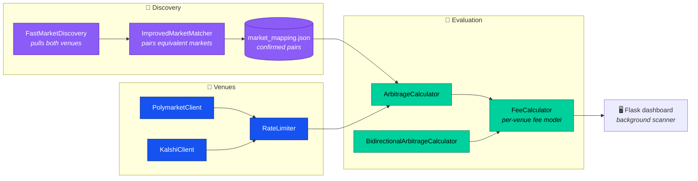

<div align="center">

# Polymarket ⇄ Kalshi Arbitrage Scanner

**Finds price discrepancies for the same real-world event listed on both prediction markets — and tells you whether the spread survives fees.**

[](https://www.python.org)
[](https://flask.palletsprojects.com)
[](https://polymarket.com)
[](https://kalshi.com)

</div>

> [!WARNING]
> Research tooling, not financial advice. A spread that looks profitable on screen
> can vanish before an order fills. Read [Limitations](#limitations) before risking anything.

---

## How it works



The hard part is not the arithmetic — it's **deciding two markets are the same event**.
"Will X happen by March 31?" and "Will X happen in Q1?" resolve differently in edge cases,
and a mismatched pair produces a spread that looks like free money and isn't.
`ImprovedMarketMatcher` proposes pairs; confirmed ones persist to `market_mapping.json`.

---

## Fees

A gross spread means nothing here. The two venues charge on completely different bases,
so a flat percentage applied to both would systematically misprice one side.

**Polymarket** — flat taker fee:

| | Rate |
|---|---|
| Taker | **0.1%** |

**Kalshi** — tiered on expected payout, so the effective rate changes with position size:

| Expected payout | Fee |
|---|---|
| $0 – $7 | flat **$1** |
| $7 – $25 | **14%** |
| $25 – $100 | **10%** |
| $100 – $1,000 | **7%** |
| $1,000+ | **5%** |

> [!IMPORTANT]
> The flat $1 minimum below $7 dominates small trades — a $5 position pays 20%.
> Small "opportunities" are usually fee artifacts. All figures the scanner reports
> are **net of fees**, computed with `Decimal` rather than floats to avoid rounding
> drift on repeated arithmetic.

---

## Setup

Requires Python 3.11+.

```bash
pip install -r requirements.txt
cp config.example.json config.json   # fill in credentials
./run.sh
```

Dashboard runs at http://localhost:5000.

> [!CAUTION]
> `config.json` is gitignored — keep it that way. The Polymarket `private_key` is a
> **wallet signing key**, not a revocable API token: anyone holding it controls that
> wallet's funds, and there is no rotate button. Use a dedicated wallet funded only
> with what you intend to trade.

---

## API

| Method | Endpoint | Purpose |
|---|---|---|
| `GET` | `/` | Dashboard |
| `GET` | `/api/status` | Scanner state and venue connectivity |
| `GET` | `/api/progress` | Progress of the running scan |
| `GET` | `/api/opportunities` | Current opportunities, net of fees |
| `GET` | `/api/config` | Active configuration (credentials omitted) |
| `POST` | `/api/scan` | Trigger a scan of mapped pairs |
| `POST` | `/api/discover` | Search both venues for new candidate pairs |

---

## Layout

```
api_client.py                    PolymarketClient, KalshiClient, RateLimiter
arb_engine.py                    FeeCalculator, ArbitrageCalculator
arb_engine_bidirectional.py      both-directions variant
arbitrage_advisor.py             CLI entry point
market_discovery.py              FastMarketDiscovery
market_mapper.py                 pairing + persistence
web_app.py                       Flask app, background scanner
templates/ static/               dashboard UI
```

---

## Limitations

Worth being explicit about, because each one turns a paper spread into a loss:

- **Quotes are snapshots.** Both legs are priced at fetch time, not fill time. A spread
  can close between scan and execution.
- **Depth is not modelled.** A displayed price is the top of book, not the price for
  your whole size. Anything past the first level fills worse.
- **Resolution criteria can differ.** The largest risk in the system. Two markets on
  "the same" event can resolve oppositely on wording alone — and you lose both legs,
  not one.
- **Capital is split across venues.** Funds sit on Polymarket and Kalshi separately;
  moving between them is neither instant nor free.
- **Rate limits.** `RateLimiter` throttles requests, so a full scan is not instantaneous.

---

## Roadmap

Tracked in [issues](../../issues): fee-model documentation (#4), a dry-run mode
defaulting to read-only (#5), dependency pinning (#1), and tests for the engine's
edge cases (#2).
